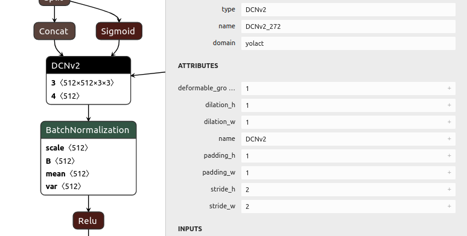

# Intro

This repo describes an available method to deploy [YOLACT+](https://github.com/dbolya/yolact)
with [onnxruntime](https://github.com/microsoft/onnxruntime) C++ API.

## Steps to Deploy YOLACT++ with ONNX RUNTIME C++ API

1. Modify YOLACT++ to export ONNX model.
    + Compile DCNv2 with `python setup.py build develop` for a dynamic library `_ext.cpython-...`.
      (Some modification might be required according to your `libtorch` version. I chose https://github.com/lbin/DCNv2)
    + Modify YOLACT++ to export ONNX models. (See below)
2. Load it.
    + Register the custom op (See `main2.cpp` for an example).
        + Wrap the tensors and extract the attributes.
    + Compile it and link it against the dynamic library. (See `CmakeLists.txt` for details)

## Notes

+ I have only compiled and run it with `USE_CUDA` and `WITH_CUDA` defined.
  Potential memory alignment error may occur when running on CPU.
+ Take care for your paths for libs.

## Modification on YOLACT++

### For DCNv2

#### In `dcn_v2.py`

Add a method to the `_DCNv2` class:
```python
class _DCNv2(Function):
    @staticmethod
    def symbolic(g, input, offset, mask, weight, bias, stride, padding, dilation, deformable_groups):
        return g.op("yolact::DCNv2", input, offset, mask, weight, bias, name_s="DCNv2",
                    dilation_h_s=str(dilation[0]), dilation_w_s=str(dilation[1]),
                    padding_h_s=str(padding[0]), padding_w_s=str(padding[1]),
                    stride_h_s=str(stride[0]), stride_w_s=str(stride[1]),
                    deformable_groups_s=str(deformable_groups))
```
(Data in types other than `str` tend to fail. So dumps as `str`s.)

These two lines are to register in python when importing custom op with python from ONNX model.
I don't know if they are necessary for exporting.
```python
from torch.onnx import register_custom_op_symbolic
register_custom_op_symbolic('yolact::DCNv2', _DCNv2.symbolic, 11)
```

Then you can see with Netron that the DCNv2 is attached with these attributes .

### For tracing and Op `Interp`
Exporting by tracing does not support jit on CUDA.
(maybe `--cuda=false` option is enough)
Interpolation is *only fully supported when op_version>=11*, and requires some changes for traceability.

#### In `utils/augmentations.py`
Remove `.cuda()` in `self.mean =` and `self.std =`.

#### In `yolact.py`
```plain
#use_jit = torch.cuda.device_count() <= 1
use_jit = False
```

Instead of checking img_sizes, we are supposed to `make sure that all images are 550x550 when input` to 
make traceable fixed-sized nodes: 
```plain
-            if self.last_img_size != (cfg._tmp_img_w, cfg._tmp_img_h):
+            if self.last_img_size is None:
```
```plain
-            elif self.priors.device != device:
+            elif False: # self.priors.device != device:
```
Provide constants instead of python variables to the function `interpolate`.
```plain
         # For backward compatability, the conv layers are stored in reverse but
 the input and output is
         # given in the correct order. Thus, use j=-i-1 for the input and output
 and i for the conv layers.
         j = len(convouts)
+        sizes=[(69,69),(35,35)]
         for lat_layer in self.lat_layers:
             j -= 1
 
             if j < len(convouts) - 1:
-                _, _, h, w = convouts[j].size()
-                x = F.interpolate(x, size=(h, w), mode=self.interpolation_mode, align_corners=False)
+                #_, _, h, w = convouts[j].size()
+                #x = F.interpolate(x, size=(h, w), mode=self.interpolation_mode, align_corners=False)
+                x = F.interpolate(x, size=sizes[j], mode=self.interpolation_mode, align_corners=False)
             
             x = x + lat_layer(convouts[j])
```
Another `cpu` specification.
```plain
class Yolact(nn.Module):
     
     def load_weights(self, path):
         """ Loads weights from a compressed save file. """
-        state_dict = torch.load(path)
+        state_dict = torch.load(path, map_location='cpu')
```

We should run the postprocess externally in C++ (See `common.cpp`).
```plain
-            return self.detect(pred_outs, self)
+            #return self.detect(pred_outs, self)
+            return pred_outs['loc'], pred_outs['conf'], pred_outs['mask'], pred_outs['priors'], pred_outs['proto']
```

#### In `eval.py`
```plain
+from layers import Detect
+import torch.onnx
```

```plain
img_gpu = torch.Tensor(img_numpy)#.cuda()
```

```plain
-        colors = torch.cat([get_color(j, on_gpu=img_gpu.device.index).view(1, 1, 1, 3) for j in range(num_dets_to_consider)], dim=0)
+        #colors = torch.cat([get_color(j, on_gpu=img_gpu.device.index).view(1, 1, 1, 3) for j in range(num_dets_to_consider)], dim=0)
+        colors = torch.cat([(torch.Tensor(get_color(j)).float()/255).view(1,1,1,3) for j in range(num_dets_to_consider)], dim=0)
```

```plain
-        masks = masks.view(-1, h*w).cuda()
-        boxes = boxes.cuda()
+        masks = masks.view(-1, h*w)#.cuda()
+        boxes = boxes#.cuda()
```

Export the ONNX model and dump the matrix `priors`, which seems not to exist in the exported model.
```plain
 def evalimage(net:Yolact, path:str, save_path:str=None):
-    frame = torch.from_numpy(cv2.imread(path)).cuda().float()
+    frame = torch.from_numpy(cv2.imread(path)).float()#.cuda().float()
     batch = FastBaseTransform()(frame.unsqueeze(0))
-    preds = net(batch)
+    pred_outs = net(batch)
+    detect = Detect(cfg.num_classes, bkg_label=0, top_k=200, conf_thresh=0.05, nms_thresh=0.5)
+    preds = detect({'loc':pred_outs[0], 'conf':pred_outs[1], 'mask':pred_outs[2], 'priors':pred_outs[3], 'proto':pred_outs[4]}, net)
+    dummy_input = torch.rand(1,3,550,550).float().cpu()
+    
+#    from torch.onnx import register_custom_op_symbolic
+#    register_custom_op_symbolic('yolact::DCNv2', _DCNv2.symbolic, 11)
+
+    torch.onnx.export(net, dummy_input, "yolact_plus.onnx",
+        input_names=['image'],
+        output_names=['loc', 'conf', 'mask', 'priors', 'proto'],
+        opset_version=11,
+        #operator_export_type=torch.onnx.OperatorExportTypes.ONNX_ATEN_FALLBACK
+    )
+    pred_outs[3].float().cpu().numpy().astype(np.float32).tofile('priors_plus.dat')
```

```plain
-                    batch = batch.cuda()
+                    batch = batch#.cuda()
```

```plain
-            net = net.cuda()
+            net = net#.cuda()
```

# License and Disclaimer

I dedicate codes in this repository to the public domain,
without warranty of any kind.
You can use it in any way at your own risk.

# Additional Info

```text
Cuda: 10.2
Cudnn: 8.0
Python: 3.7
Libtorch: 1.7.1
Onnx Runtime: 1.6.0
```
